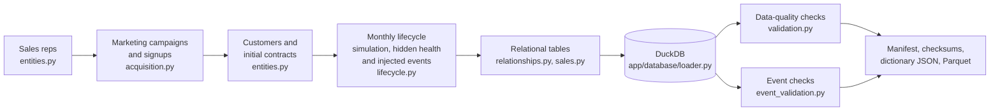

# Northwind Cloud — Synthetic Data

Northwind Cloud is a fictional B2B SaaS analytics company headquartered in Singapore
(reporting currency **SGD**). This directory contains the reproducible generator for its
business data, the dataset manifest and the evaluation ground truth.

> **Audience:** developers and evaluators. This document describes the hidden generator
> mechanism and the injected events, so it must **never** be given to the AI agent as context
> (for example through retrieval). The agent may only see the business database and
> `docs/data-dictionary.md`.

## Quick start

```bash
python -m venv .venv && source .venv/bin/activate
pip install -e ".[dev]"

# Generate, load, validate and write metadata (about 30 seconds)
python -m data.generator.generate
```

The command builds `database/northwind_cloud.duckdb` from scratch and writes:

| Output | Path | Committed? |
|---|---|---|
| DuckDB business database | `database/northwind_cloud.duckdb` | no (about 250 MB, rebuild with the command above) |
| Dataset manifest | `data/metadata/dataset_manifest.json` | yes |
| Per-table checksums + dataset fingerprint | `data/metadata/dataset_checksums.json` | yes |
| Machine-readable data dictionary | `data/metadata/data_dictionary.json` | yes |
| Injected-event ground truth (evaluation only) | `data/seeds/injected_events.json` | yes |
| Parquet export of every table | `data/seeds/parquet/*.parquet` | no |

The human-readable data dictionary (`docs/data-dictionary.md`) is generated from the same
schema metadata with `python -m app.database.data_dictionary`.

## Configuration

| CLI flag | Environment variable | Default | Meaning |
|---|---|---|---|
| `--seed` | `DATA_SEED` | `42` | Random seed |
| `--customers` | | `5000` | Total customers, including those acquired before the window |
| `--start` | | `2024-09-01` | First day of the window (must be the 1st of a month) |
| `--end` | | `2026-08-31` | Last day of the window (must be a month end) |
| `--db-path` | `DATABASE_URL` (`duckdb:///...`) | `database/northwind_cloud.duckdb` | DuckDB output file |
| `--parquet-dir` / `--no-parquet` | | `data/seeds/parquet` | Parquet export |
| `--metadata-dir` | | `data/metadata` | Manifest, checksums, dictionary JSON |
| `--ground-truth` | | `data/seeds/injected_events.json` | Ground-truth output |
| `--lenient-events` | | off | Report instead of fail on event checks (for tiny datasets) |

Precedence: CLI flag > environment variable (or `.env`) > default. The business assumptions
(prices, channel economics, churn intercepts, seasonality, event strengths) are in
`data/generator/config.py` and `data/generator/events.py`, not scattered through the code.

Example of a fast, small dataset (as the tests use):

```bash
python -m data.generator.generate --customers 100 --start 2026-03-01 --end 2026-08-31 \
  --db-path /tmp/nw_small.duckdb --metadata-dir /tmp/nw_meta --ground-truth /tmp/nw_gt.json \
  --no-parquet --lenient-events
```

## Pipeline



| Step | Module | What happens |
|---|---|---|
| 1. Entities | `entities.py` | 20 sales reps (APAC 7, EMEA 5, North America 6, LATAM 2), unique synthetic company names, firmographics, initial plan, seats and discount |
| 2. Acquisition | `acquisition.py` | Weekly campaign funnel: spend → impressions → clicks → leads → conversions. Each conversion becomes a customer with that channel and a signup in the same week. Outbound and referral signups fill the rest. Pre-window customers get signup dates from 2021 onwards |
| 3. Lifecycle | `lifecycle.py` | Month-by-month simulation of engagement, utilisation, support tickets, hidden health, churn, expansion and contraction, with the injected events applied |
| 4. Tables | `relationships.py`, `sales.py` | Versioned subscriptions, daily revenue, weekly usage, tickets, daily feature adoption and the CRM pipeline, all derived from the same histories |
| 5. Load | `app/database/loader.py` | Fresh DuckDB file with PK, FK and CHECK constraints, indexes and analytical views |
| 6. Validate | `validation.py`, `event_validation.py` | 184 data-quality checks and 19 event checks. The build fails on any error |
| 7. Metadata | `manifest.py` | Manifest in the required template (every count is queried, never hard-coded), checksums, dictionary JSON, optional Parquet |

## How the data is made realistic

The generator is a causal simulation, not a set of independent random columns.

| Relationship | Mechanism |
|---|---|
| Enterprise customers pay more | Segment sets seats (log-normal medians: 9 / 30 / 80) and plan mix. MRR = seats × plan price × (1 − negotiated discount) |
| Usage drives health | Latent engagement sets seat utilisation, sessions, API calls and feature breadth |
| Health drives churn, expansion and contraction | Monthly logistic hazards on hidden health, with segment-specific intercepts |
| Support problems hurt health | Ticket volume, slow resolutions and negative sentiment lower next month's engagement. Less engaged accounts raise more tickets (feedback loop) |
| Declining usage precedes churn | Falling engagement lowers utilisation before it raises churn risk |
| Marketing has diminishing returns | Click-through rate falls as weekly spend rises above the channel's usual level (ad fatigue), so leads grow sub-linearly with spend |
| Realistic sales funnel | Stage conversions Lead → Qualified → Proposal → Negotiation → Won per rep. Lost deals record the stage where they were lost. Cycle length grows with segment |
| Pipeline feeds revenue | Every won New Business deal equals 12 × the new customer's initial MRR and closes on the signup date. Most Mid-Market/Enterprise expansions close through a won Expansion deal worth 12 × the MRR added |
| Seasonality | Bookings and expansions dip in August and around the new year and peak in December. Usage dips in regional holidays (EMEA summer, Lunar New Year in APAC, year end) |
| Segment behaviour | SMB churns most, Enterprise least. Enterprise gets faster support resolution and longer sales cycles |
| Plan behaviour | Starter has no API access. Higher plans include more features and higher API quotas, and overage above quota is billed as usage revenue |

Noise is added at every step (log-normal spend and usage noise, Poisson and binomial counts,
AR(1) engagement shocks), so no relationship is deterministic.

### Hidden customer health (never stored)

Each month, for every live customer:

```
engagement[t] = 0.8·engagement[t−1] + 0.2·segment_mean (+ AI Insights adoption lift)
              + 0.3·support_experience[t−1] + noise  (− event shocks)
utilisation   = sigmoid(1.3·engagement + 0.6) × regional seasonality
health        = 0.8·engagement + 0.35·support_experience − plan-fit penalty
              + tenure effect + adoption bonus + noise
P(churn)      = sigmoid(segment_intercept − 1.2·health)
P(expansion)  = sigmoid(segment_intercept + 1.0·health) × bookings seasonality
P(contraction)= sigmoid(intercept − 1.0·health)
```

Engagement, utilisation, health, API intensity, adoption propensity and rep skill exist only
in memory during generation. The data-quality step `exposure:*` fails the build if the
database contains any undocumented table, view or column, or any column whose name suggests a
hidden variable (`health`, `engagement`, `propensity`, `cohort`, `skill`, ...). A test also
confirms this check catches an injected `health_score` column.

## Injected business events

These are the ground truth the evaluation framework will use to check whether the agent
discovers them from ordinary business data. They are applied *inside* the simulation (they
change customer, campaign or rep behaviour), so they surface only as observable effects.

| ID | Event | Mechanism (generator-side) | Observable signal |
|---|---|---|---|
| E1 | Singapore Enterprise churn wave, August 2026 | 9% of Singapore Enterprise accounts churn (last service day 1–12 Aug), 30% contract. Mild spill-over to Singapore Mid-Market. Billing complaints in July–August | Revenue −0.97% and MRR −0.76% in August. Singapore is the largest negative country (−84.9k MRR) and Singapore × Enterprise the largest negative country/segment cell (−67.0k, −14% of the cell) |
| E2 | Support-ticket spike, 8 Jun – 24 Jul 2026 | Bug ×2.6, Integration ×2.0 and Performance ×1.4 ticket rates, resolution times ×1.7, engagement shock for affected accounts | Tickets per active customer-month +33% (Jun–Jul vs Mar–May), Bug/Integration share 25% → 37%, median resolution 28h → 42h |
| E3 | Inefficient Paid Social campaign (Q2 2026) | Spend ×1.6 with lead quality ×0.38 | Highest CAC of any campaign with ≥ 10 conversions: 3.1× the Paid Social median (2.2–2.8× on other seeds) |
| E4 | Sales rep with consistently low conversion | Every funnel transition ×0.85 for one rep | Lowest win rate: 9.9% vs a 19.3% team median |
| E5 | AI Insights launch, 2 March 2026 | Monthly adoption hazard for eligible plans; adopters gain engagement | Feature rows start on the launch date; adoption rises steadily |
| E6 | Structurally higher SMB churn | Segment churn intercepts | SMB has the highest monthly logo churn |
| E7 | Usage decline before churn | 3% of established accounts disengage from April 2026, with extra churn risk in July–August | Weekly active users fall before churn; tickets rise for the same accounts |

Separation from the agent:

- The ground truth is written to `data/seeds/injected_events.json`, **outside** the database.
  There is no `business_events` table.
- Generator-side event checks (`data/generator/event_validation.py`) read the ground truth to
  confirm each event is detectable through business data. They are internal build checks, not
  analytical tools, and must not be registered as agent tools in later phases.
- Campaign names, rep names and all other values are ordinary business labels that do not
  reveal the events.

### Calibration

Events are tuned to be detectable but not trivial.
- **E1 is detectable but not extreme.** Singapore Enterprise churn in August is 9 of 101
  accounts (8.9%) against a trailing 12-month baseline of 0.19% per month. That is highly
  significant (one-sided exact binomial p ≈ 2e-11) but plausible for a renewal-driven churn
  wave in one market. At company level the effect is modest: revenue −0.97% and MRR −0.76%
  month on month (−0.6% to −1.7% on other seeds), and logo churn barely moves. Other segments'
  growth can mask it in a segment-only view, so the concentration shows up in the
  country × segment breakdown.
  *History:* the first Phase 1 build used a 20% churn share (19.8% observed). It was reduced
  to 9% because that level was unrealistically extreme.
- **Robustness across seeds.** All 19 event checks and 184 quality checks pass with seeds 42,
  7, 99, 123 and 2024 at full scale. E1 churn ranges from 8.5% to 9.5%, and Singapore ×
  Enterprise is the most negative cell on every seed.
- **Emergent trap.** Churned customers raise more tickets per month *within every segment*.
  Pooled across segments the comparison reverses, because churners are mostly small SMB
  accounts (Simpson's paradox). The agent should segment before concluding.

## Data-quality validation

`validation.py` runs 184 checks against the loaded database, grouped as:

| Group | Examples |
|---|---|
| A. Row counts | Every table non-empty; customer count equals the configuration |
| B. Date ranges | All dates inside the window; revenue on every day |
| C. Primary keys | No duplicate keys in any table |
| D. Required fields | Zero NULLs in every NOT NULL column |
| E. Null rates | Nullable columns within expected bounds; open/resolved ticket fields agree |
| F. Referential integrity | No orphaned `customer_id`; denormalised region and segment match the customer; won deals have customers |
| G. Categorical values | Every enumerated column within its allowed set |
| H. Non-negative values | Revenue, MRR, spend, counts ≥ 0; probabilities and adoption within [0, 1] |
| I. Date logic | `close_date ≥ created_date`, `resolved_at ≥ created_at`, `end_date ≥ start_date`, signup equals first subscription |
| J. Revenue consistency | Revenue only while a subscription is in force; every in-force day has revenue; full months recognise exactly the MRR; no usage revenue on Starter |
| K. Subscription consistency | Contiguous, non-overlapping records; `previous_mrr` chain; change type matches MRR movement; status and `current_mrr` rules; price consistent with seats |
| L. Customer consistency | One `new` record per customer; status matches subscriptions; no activity before signup or after churn; active users within seats |
| M. Marketing consistency | conversions ≤ leads ≤ clicks ≤ impressions; campaign conversions equal customers acquired per channel |
| N. Business sanity | Enterprise > Mid-Market > SMB MRR and deal size; SMB churns most; churned accounts used the product less; no month-to-month MRR swing above 10% |
| O. Exposure | Only documented tables, views and columns; no hidden or ground-truth columns |

Group N compares aggregates and is therefore a warning (not a failure) for datasets under
1,000 customers. All other groups always fail the build.

## Reproducibility

- One `numpy.random.Generator` seeded from the configuration is threaded through every step.
  There is no global random state and no wall-clock input (only the manifest's
  `generation_timestamp` records when the build ran).
- **Same seed and configuration give the same logical dataset.** `dataset_checksums.json`
  stores an order-independent MD5 per table and a SHA-256 fingerprint of the whole dataset.
  The tests regenerate and compare these; a different seed gives a different fingerprint.
- `tests/integration/test_repository_database.py` checks that the locally built database
  matches the committed checksums.

## Data lineage foundation

`app/database/lineage.py` defines what later phases need to trace every number to its source:

- `DatasetInfo`: dataset name, version, schema version and window, loaded from the manifest.
- `LineageRecord`: `dataset_version`, `query_id`, `tool_run_id`, `source_tables`,
  `calculation`, `execution_timestamp`.
- `new_query_id()` / `new_tool_run_id()`, and `extract_source_tables(sql)`, which uses the
  sqlglot parser and excludes CTE names.

Every call to `Database.query()` (read-only DuckDB connection) returns a `QueryResult`
carrying a `LineageRecord`. The Phase 4 evidence layer will attach these records to claims.
