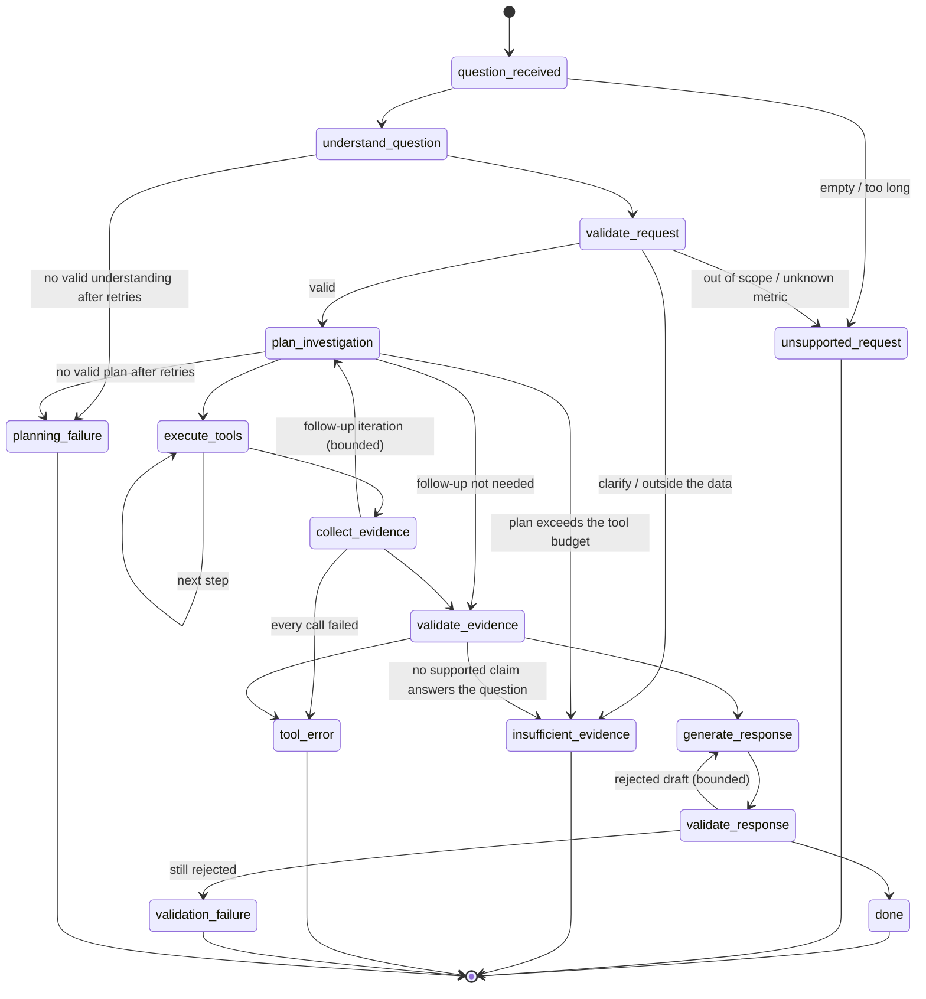

# Agent architecture (Phase 4)

> **The LLM is never the source of a business number.** It reads the question, proposes an
> investigation plan from an allow-list of tools, and words an answer from claims that were
> already built and validated from tool results. Every number comes from the deterministic
> Phase 2 (KPIs, analytics) and Phase 3 (forecasting, anomaly detection) layers. Every number in
> the final text is checked against the evidence it cites.

- KPI definitions: [kpi-catalog.md](kpi-catalog.md) · analytics: [analytics.md](analytics.md)
- Forecasting: [forecasting.md](forecasting.md) · anomaly detection: [anomaly-detection.md](anomaly-detection.md)
- Plan and phase notes: [implementation-plan.md](implementation-plan.md)

## 1. Agent architecture

```text
USER question
  │
  ▼
LangGraph state machine (app/agent/graph.py) ─ every loop bounded by AgentConfig
  │
  ├─ understand_question ──► LLM (structured JSON: intent, metric, period, filters)
  ├─ validate_request ─────► deterministic: catalogue, dimensions, data coverage
  ├─ plan_investigation ───► LLM (structured JSON: allow-listed tool calls) → validated against tool schemas
  ├─ execute_tools ────────► ToolRegistry → Phase 2 / Phase 3 services → Database (read-only)
  ├─ collect_evidence ─────► deterministic: Evidence from typed results, Claims from Evidence
  ├─ validate_evidence ────► deterministic: 10 checks per claim
  ├─ generate_response ────► LLM (structured JSON: wording that cites claim IDs)
  ├─ validate_response ────► deterministic: every number, citation, label and causal phrase checked
  ▼
AgentRunResult (answer, findings, interpretation, recommendations, caveats, evidence, tool trace)
```

| Package | Responsibility | Knows about |
|---|---|---|
| `app/agent/` | State, graph, request validation, claim builders, response assembly, runner, logging | tools, evidence, llm |
| `app/tools/` | 12 typed tools, registry, SQL safety | Phase 1–3 services only |
| `app/evidence/` | Evidence and claim models, the claim–evidence graph, evidence and response validators, number formatting and extraction | nothing above it |
| `app/llm/` | Provider-neutral interface, prompts, output schemas, deterministic/scripted/Anthropic providers | nothing above it |

The runtime (`AgentRuntime`) holds the database, the tool context, the registry and the model
client. The state holds only data. Tools are plain functions that Phase 6 can wrap without
changes.

## 2. LangGraph state machine



Each node returns a partial state update and names the next node in `state.route`. The
conditional edges list their allowed targets explicitly, so a node cannot route anywhere else.
The five failure nodes are terminal. Each builds a deterministic response for its status
(`failure_response`) that contains no unsupported numbers. When claims were already validated,
an insufficient-evidence or validation-failure response still shows them. `done` sets
`completed`, or `insufficient_evidence` for a causal question (see §12).

## 3. State schema

`AgentState` (`app/agent/state.py`) is a Pydantic model. Everything in it is JSON-serialisable
(tested with `model_json_schema()` and a round-trip of the run result):

| Group | Fields |
|---|---|
| Input | `run_id`, `question`, `normalized_question`, `started_at` |
| Understanding | `understanding` (`UnderstandingOutput`), `request` (`ValidatedRequest`) |
| Planning | `plans` (`InvestigationPlan` per iteration), `pending_steps`, `current_step`, `planning_iterations` |
| Execution | `tool_calls` (`ToolCallRecord` trace), `tool_results` (`ToolResult`), `processed_call_ids` |
| Evidence | `evidence_graph` (`EvidenceGraph`), `evidence_validation` |
| Response | `response_draft`, `response_validation`, `response` (`AgentResponse`), `response_generated_by` |
| Control | `retry_count`, `tool_retries`, `llm_retries`, `llm_calls` (`LLMCallRecord`), `limit_reached`, `status`, `status_message`, `errors`, `transitions`, `route` |

It holds no database connection, no model client, no secrets and no prompts. `LLMCallRecord`
stores the task, provider, model, attempts, token counts and the error, not the prompt.
Convenience views: `intent`, `date_range`, `filters`.

## 4. Tool registry

`ToolRegistry` (`app/tools/registry.py`) is the only way the agent calls data. The planner can
only name registered tools.

| Tool | Wraps | Result |
|---|---|---|
| `get_kpi` | Phase 2 `KPIService.calculate_kpi` (+ comparison with Phase 2 `pct_change`) | `KPIResult` / `KPIComparison` |
| `analyze_revenue` | `revenue_by_period`, `revenue_change`, `decompose_revenue_change`, `revenue_bridge`, `mrr_series`, `revenue_concentration` | `AnalyticsResult` |
| `analyze_customers` | `churn_summary`, `churn_by_dimension`, `customer_movements`, `monthly_churn_series`, `usage_churn_relationship` | `AnalyticsResult` |
| `analyze_sales` | `pipeline_summary`, `sales_performance`, `rep_performance`, `opportunity_conversion`, `funnel_stage_distribution`, `segment_performance` | `AnalyticsResult` |
| `analyze_marketing` | `channel_performance`, `campaign_performance`, `marketing_period_change`, `channel_roas` | `AnalyticsResult` |
| `analyze_support` | `support_summary`, `support_by_dimension`, `support_volume_change`, `resolution_time_trend` | `AnalyticsResult` |
| `analyze_product` | `feature_adoption`, `adoption_trend`, `adoption_change`, `feature_launch_summary`, `adoption_breadth_by`, `feature_usage_distribution` | `AnalyticsResult` |
| `get_cohort_analysis` | `cohorts.cohort_retention` | `AnalyticsResult` |
| `get_customer_risk` | `risk.score_customer_risk` (observable signals only) | `AnalyticsResult` |
| `forecast_metric` | Phase 3 `ForecastService.forecast` | `ForecastResult` |
| `detect_anomalies` | Phase 3 `AnomalyService.detect` | `AnomalyReport` |
| `run_safe_sql` | `validate_sql` + Phase 2 `QueryRunner` on the read-only `Database` | `SQLResult` |

Each `ToolDefinition` carries a description, when to use it, what it must not be used for, its
output, limitations, the source layer, a strict input model and the handler. `catalog()` gives
the compact form that goes into planning prompts. There are no handlers or internals in it, and
no ground-truth vocabulary (tested).

## 5. Tool contracts

- **Input**: a Pydantic model with `extra="forbid"`. An unknown argument is rejected, never
  ignored. Analytics tools take an `operation`, and each operation declares its required and
  accepted arguments. For example, `revenue_bridge` does not accept `dimension`.
  `validate_arguments` returns the canonical argument dict (`exclude_unset`) used for
  de-duplication and the trace.
- **Request**: `ToolRequest(call_id, tool_name, arguments, purpose)`.
- **Result**: `ToolResult(call_id, tool_name, arguments, success, status, result, result_type,
  error, message, started_at, finished_at, execution_time_ms, source_tables, query_ids,
  calculation, limitations, attempts)`. `result` is the service's own typed model, so no numbers
  are copied or re-derived in between.
- **Errors**: `ToolError(code, message, retryable)`. The codes are `unknown_tool`,
  `invalid_arguments`, `unsafe_sql`, `database_error` (the only retryable one), the Phase 2/3
  error code (`unsupported_kpi`, `invalid_filter_value`, `invalid_horizon`, ...) or
  `internal_error`. A failed call is recorded. It is never replaced by a fabricated result.

## 6. Evidence model

`build_evidence(result, graph)` (`app/evidence/builder.py`) turns one successful `ToolResult`
into evidence items. Each `Evidence` has `evidence_id`, `evidence_type`, a neutral `statement`,
`metric`, `value`, `unit`, `display_value`, period and comparison labels and dates, `filters`,
`dimension`/`dimension_value`, further numbers in `attributes`, method details (model, detector,
threshold, ...) in `details`, `status`, `truncated`, and provenance: `tool_name`,
`tool_call_id`, `operation`, `query_ids`, `source_tables`, `calculation`,
`execution_timestamp`, `limitations` and `confidence`.

| Type | Meaning | Example |
|---|---|---|
| `observed` | Direct aggregate of recorded data | Revenue for 2026-08 |
| `calculated` | Ratio, change or decomposition from the analytics layer | Change vs 2026-07, share of gross decline |
| `forecast` | A forecast point with its interval and model | Revenue 2026-09 forecast |
| `anomaly` | A month flagged by a detector, with score and threshold | 2026-08 flagged by rolling z-score |
| `derived` | A structural fact about other results | "1 of 12 months flagged" |

Builders exist for KPI results, KPI comparisons, forecasts, anomaly reports, SQL results and
each analytics operation. A generic builder handles the rest. Statements use the Phase 2/3
numbers verbatim through one formatter (`format_value`).

## 7. Claim model

A `Claim` is what the answer asserts: `claim_id`, `text`, `claim_type`, `evidence_ids`,
`support_status`, `confidence`, `limitations`, `kind` (kpi_value, change, contribution,
concentration, ranking, forecast, anomaly_summary, association, recommendation, ...), `primary`
(directly answers the question), `numeric_assertions` (each number and the evidence field it
comes from), `direction` + `direction_evidence`, and the period the claim is about.

| Claim type | Allowed wording | Must rest on |
|---|---|---|
| `observed_fact` | "Revenue for 2026-08: SGD …" | `observed` evidence only |
| `calculated_result` | "changed by …", "accounted for …% of the gross decline" | any evidence type |
| `inference` | "was concentrated in", "coincided with", "was associated with" | evidence; never shown as a finding |
| `recommendation` | "Review …", "Check …" | evidence; listed separately |

The `EvidenceGraph` holds evidence and claims with many-to-many links: `add_evidence`,
`add_claim` (rejects unknown evidence IDs and sets support), `link_claim_to_evidence`,
`get_supporting_evidence`, `claims_supported_by` and `validate_claim_support`. Support is
`supported` when every linked item is usable, `partially_supported` when some are, and
`unsupported` when none are. Evidence that has no provenance or reports no data or too little
data is not usable.

Claims are built deterministically by `build_claims` (`app/agent/findings.py`) from the evidence,
never by the model. The concentration rule is fixed: a member is "concentrated" when it
accounts for at least 50% of the gross decline or increase. Rankings note overlapping
confidence intervals, and associations are labelled as associations.

## 8. Evidence validation

`validate_evidence` (`app/evidence/validation.py`) runs before any text is written. For every claim:

1. A numerical claim must have evidence.
2. Its evidence comes from an executed, successful tool call.
3. The evidence has provenance: call ID, query IDs, source tables and calculation.
4. The evidence covers the period the claim is about (not stale).
5. The numbers the claim asserts equal the evidence values (no contradictions).
6. The stated direction agrees with the sign of the evidence.
7. An `observed_fact` rests on observed evidence only.
8. There is no causal language (negated forms such as "does not establish that … caused" are allowed).
9. Evidence that reports `no_data`/`insufficient_*` does not support a fact.
10. A claim on a truncated SQL result says it is truncated.

At least one supported primary claim must answer the question. Unsupported claims are
removed and the graph is re-validated. The removal is recorded as a warning, and failed tools
become caveats. If nothing answers the question, the run ends in `insufficient_evidence`.

## 9. Response validation

`validate_response` checks the model's draft against the claims it cites:

- The answer cites at least one claim, and every section item cites claims that exist and are supported.
- **Every number** in the text is found in the cited claims' evidence. Display rounding is
  allowed (for example "SGD 5.75 million" for 5,752,877). Dates, years, quarters, IDs and small
  structural counts (≤ 24, such as "3 months") are ignored. A number from other, uncited
  evidence is rejected.
- No causal statement.
- A forecast is labelled as a forecast, and an anomaly as statistically unusual or flagged.
- An inference or recommendation is not presented as a key finding. A recommendation cites a recommendation claim.
- A truncated result is not presented as complete.
- An unanswerable request carries no findings and no business numbers.
- The total length stays within `max_response_chars`.

A rejected draft is regenerated with the errors as feedback, at most `max_retries` times, and
then the run ends in `validation_failure`. The failure response names the failed checks
("numbers not found in the cited evidence"). It never repeats the rejected text, which stays
in the run's error trace for developers.

## 10. LLM boundary

`LLMClient.generate(LLMRequest) -> LLMResponse` (`app/llm/base.py`) is used for exactly three tasks:

| Task | Input context | Output schema | Validated by |
|---|---|---|---|
| `understand_question` | question, as-of date, vocabulary (intents, KPI keys, dimensions and allowed values, product features, period specs) | `UnderstandingOutput` | Pydantic + `validate_understanding` |
| `plan_investigation` | validated request, tool catalogue, remaining budget, executed steps, compact evidence summaries | `PlanOutput` (`arguments_json` per step) | Pydantic + tool input models + budget |
| `generate_response` | claims (ID, type, kind, text, primary) | `ResponseDraftOutput` (text + claim IDs) | `validate_response` |

The prompts (`app/llm/prompts.py`) state the ground rules. The model never produces numbers,
never invents, estimates or recalculates, never treats an inference as a fact, never claims
causality, says when evidence is insufficient, and answers with JSON only. The JSON schemas are
strict (every property required, `additionalProperties: false`, tested), and every output is
parsed and validated as untrusted input.

Providers:

| `LLM_PROVIDER` | Class | Notes |
|---|---|---|
| `deterministic` (default; alias `offline`) | `DeterministicLLM` | Rule-based understanding, intent playbooks, claim composition. No network, no key, no randomness |
| `anthropic` | `AnthropicLLM` | Official SDK (optional extra `.[anthropic]`), `LLM_MODEL` default `claude-opus-5`, structured outputs via `output_config.format`, refusal and `max_tokens` stop reasons handled, server-side fallbacks enabled, SDK errors normalised to `LLMError(retryable=…)`. The key comes from `ANTHROPIC_API_KEY` (a `SecretStr`), is never logged and is never placed in state |
| (tests) | `ScriptedLLM` | Replays scripted outputs, exceptions or callables per task and records requests |

A provider failure in `generate_response` falls back to deterministic composition of the same
claims. The run records this (`generated_by="deterministic-fallback"`, error `llm_failed`).

## 11. Deterministic tool boundary

Everything numeric happens below the tool boundary: KPI SQL, analytics, forecasting, anomaly
scoring, SQL execution and the formatting of numbers into claim text. The agent layer only
reads typed results, copies their numbers into evidence, and builds claims with fixed templates
and rules. Neither the planner nor the writer sees raw rows. The writer sees claim text, whose
numbers are the tools' numbers, and the validator rejects any number that is not in the cited
evidence.

The deterministic model is an interface-compatible stand-in for a network model. It parses
language with rules and vocabulary from the context. It does not contain business answers,
dataset member names or business numbers (static tests), and its drill-down member (for example
the most concentrated country) is read from evidence at run time.

## 12. Failure handling

| Situation | Path | Response |
|---|---|---|
| Empty or over-long question | `unsupported_request` | Scope statement + reason |
| Out of scope (stock prices, weather, other companies), write requests | `unsupported_request` | Scope statement; no tools run |
| Unknown metric or dimension | `unsupported_request` | Supported values listed |
| Material ambiguity, uninterpretable period | `insufficient_evidence` | "Please clarify …" |
| Future period, before the data, horizon > 6, filter value that does not exist | `insufficient_evidence` | The reason, e.g. "after the latest available data" |
| No valid understanding or plan after retries | `planning_failure` | Explanation; errors in the trace |
| Plan exceeds the tool budget | `insufficient_evidence` | "Investigation limit reached before sufficient evidence could be collected." |
| Every tool call failed | `tool_error` | Failed tools and error codes |
| Some tool calls failed | continues | Caveat per failed tool |
| No supported claim answers the question | `insufficient_evidence` | Validated partial findings, if any |
| Causal question ("What caused churn?") | `insufficient_evidence` after a validated response | Observed associations + "does not establish causes" caveat |
| Draft still rejected after regeneration | `validation_failure` | Failed check names + validated findings |
| Recursion bound hit (defensive) | `insufficient_evidence` | Limit message |

## 13. Retry limits

All limits come from settings (`AGENT_*`, `LLM_*`) through `AgentConfig`:

| Limit | Default | Applies to |
|---|---|---|
| `max_tool_calls` | 12 | Tool calls per run. A plan that needs more is rejected, not truncated |
| `max_retries` | 2 | Per LLM step (invalid JSON/schema/plan, retryable provider error), per retryable tool error, and for response regeneration |
| `max_planning_iterations` | 2 | Initial plan + one evidence-driven follow-up |
| `sql_row_limit` | 200 | Rows returned by `run_safe_sql`; callers cannot raise it |
| `max_run_seconds` | 120 | Wall clock, checked before every tool call |
| `max_response_chars` | 4000 | Response text |
| `max_question_chars` | 1000 | Question text |
| `recursion_limit` | derived | LangGraph super-step bound computed from the limits above |

Retries feed the validation errors back to the model (`context["feedback"]`). Non-retryable tool
errors (invalid arguments, unsafe SQL, unsupported KPI) are not retried.

## 14. SQL safety

`run_safe_sql` is the minimum safety required in Phase 4. Formal guardrails are Phase 5.
`validate_sql` parses with sqlglot (DuckDB dialect) and accepts a statement only if all of the
following hold:

1. Exactly one statement, and it is a `SELECT` (with optional CTEs) or a set operation of
   selects. Refused: `INSERT/UPDATE/DELETE/MERGE`, `CREATE/DROP/ALTER`,
   `ATTACH/COPY/EXPORT/PRAGMA/SET/INSTALL/LOAD/CALL/DESCRIBE/SHOW` and `SELECT … INTO`.
2. Tables are allow-listed business tables and views (from the Phase 1 metadata) or CTEs, as
   plain unqualified names. File paths, table functions (`read_csv`, `glob`, `duckdb_tables()`,
   `range`), other schemas and catalogs are refused.
3. There is no function that reads files, the environment or system state (deny-list of names
   and prefixes).
4. Columns are known columns or aliases. PII-tagged columns (`sales_opportunities.sales_rep`)
   are withheld, and `SELECT *` is refused on tables that contain them.
5. Values are bound as named `$parameters` (scalars only). Positional placeholders and string
   formatting are not used.
6. `LIMIT` must be a literal. It is capped at the row limit + 1, so truncation is detected and
   reported (`truncated=True`, a limitation note, truncated evidence, and a validator requirement
   to disclose it).

Execution goes through the Phase 2 `QueryRunner` on the Phase 1 `Database`, which is opened
read-only. A write that got past validation would still fail (tested). The agent never opens
database files itself.

## 15. Ground-truth isolation

- No Phase 4 module imports the generator (`data.*`) or reads `data/seeds/injected_events.json`,
  a ground-truth file, the hidden customer-health mechanism or generator calibration. Static
  tests cover `app/agent`, `app/llm`, `app/tools` and `app/evidence`.
- The SQL allow-list contains only persisted business tables and views. The hidden health
  process is never persisted, and file access is refused.
- Prompts contain vocabulary, the tool catalogue, the validated request and evidence summaries
  (tested: no ground-truth terms in prompts or logs).
- There are no hard-coded dataset members ("Singapore", "Enterprise", …), business numbers or
  business dates in the source (static test). A drill-down target is read from evidence.
- End-to-end tests check the agent against direct Phase 2/3 calls, never against injected
  ground truth.

## 16. Example investigation flow

"Why did revenue decline last month?" with the deterministic model:

1. `understand_question`: `revenue_investigation`, metric `revenue`, period `last_month`,
   analysis `change`.
2. `validate_request`: August 2026 vs July 2026 (the previous period is recorded as an assumption).
3. `plan_investigation` (iteration 1):
   - `analyze_revenue.revenue_change`
   - `decompose_revenue_change` by region, segment and country
   - `revenue_bridge`
   - `detect_anomalies(revenue)`

   This is 6 calls, validated against the tool schemas.
4. `execute_tools` → `collect_evidence`: evidence with query IDs. The claims give the change,
   the largest contributor per dimension with its share of the gross decline, the
   concentration inferences, the largest negative MRR movement and the anomaly flag.
5. `plan_investigation` (iteration 2, evidence-driven): the most concentrated geographic member
   (rank 1, share ≥ 50%, read from the evidence) is drilled into. The follow-up runs the segment
   decomposition, churn by segment and an MRR anomaly check within that member (3 calls).
6. `validate_evidence`: 10 checks per claim; one supported primary claim required.
7. `generate_response` → `validate_response`: the answer states the change and the
   within-member concentration, with findings, inferences worded as "was concentrated in" /
   "coincided with", two recommendations, and caveats (anomaly flags do not explain causes,
   overlapping intervals).
8. `done`: `completed`, 9 tool calls, about 0.5 s on the full dataset.

"What caused churn?" produces the observed churn figures and the pre-churn usage and ticket
associations, with status `insufficient_evidence` and a caveat that the analysis does not
establish causes.

## 17. How Phase 5 will extend security

Phase 5 adds the formal guardrails framework on top of these boundaries:
- input screening (prompt injection, destructive intent, PII scrubbing in logs)
- a security test suite (injection and exfiltration attempts)
- per-query timeouts on SQL execution
- policy configuration for the SQL allow-list
- uncertainty labelling

The Phase 4 checks stay as the innermost layer. These are the strict tool schemas, the SQL
validator, the read-only connection, the evidence and response validators, and the logging
allow-list.

## 18. How Phase 6 will expose tools through MCP

`ToolDefinition` already carries what an MCP tool needs: name, description, JSON input schema
(`input_schema`), output description, and a pure handler `(ToolContext, input) -> ToolOutput`.
Phase 6 will register the same `TOOL_DEFINITIONS` with an MCP server that builds a `ToolContext`
on the read-only database, and return `ToolResult` JSON with provenance. There is no agent
logic in the tools, so MCP clients get the same numbers and the same error codes.

## 19. How Phase 7 will evaluate the agent

`AgentRunResult` is designed for scoring:
- status, answer, findings and caveats
- the claims and evidence (with query IDs)
- the full tool trace
- LLM call records (attempts, tokens)
- retries, transitions and timing

Phase 7 benchmark cases can score:
- routing (intent and status)
- tool selection (trace vs expected tools)
- numerical accuracy (evidence vs reference queries)
- grounding (response validation pass rate)
- causal-language and hallucination rates
- latency and retries

Each case can be run with the deterministic model and, where a key is configured, with the
Anthropic provider.

## 20. How Phase 8 will expose the agent through API/UI

`AgentRunner(db).run(question) -> AgentRunResult` is the single entry point, and the result is a
JSON-serialisable Pydantic model. A FastAPI endpoint can return `result.response`, with the
trace on request. A Streamlit page can render the answer, the findings with their evidence IDs,
caveats and assumptions, and an expandable tool trace with query IDs. Neither needs to reach
into the graph. Configuration (provider, model, limits) comes from the same settings.
