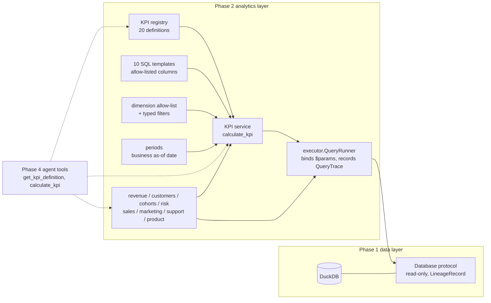

# Analytics Engine (Phase 2)

> **The analytics layer is the source of truth for business numbers.** Every KPI and
> analytical result is computed here, deterministically, from registered and reviewable SQL
> plus documented Python calculations. The future agent (Phase 4) may *explain* these
> numbers. It never invents, recalculates or silently redefines them.

- KPI definitions, formulas and SQL: [kpi-catalog.md](kpi-catalog.md) (generated from the registry)
- Schema and data conventions: [data-dictionary.md](data-dictionary.md)

## 1. Architecture



| Module | Responsibility |
|---|---|
| `app/analytics/kpis/definitions.py` | The registry: 20 typed `KPIDefinition`s (definition, formula, SQL, unit, time grain, interpretation, limitations, dependencies) |
| `app/analytics/kpis/sql.py` | 10 parameterised SQL templates and their allow-listed filter/breakdown columns; the point-in-time rule |
| `app/analytics/kpis/service.py` | `calculate_kpi`: validation, period resolution, coverage checks, execution, value rules, typed results |
| `app/analytics/kpis/models.py` | `KPIDefinition`, `ValueRule`, `KPIParameters`, `KPIResult` |
| `app/analytics/dimensions.py` | The single dimension allow-list and typed `Filters` (values from Phase 1 metadata) |
| `app/analytics/periods.py` | Period resolution relative to the business as-of date |
| `app/analytics/executor.py` | The only execution boundary: binds named parameters and records provenance |
| `app/analytics/models.py` | Generic `AnalyticsResult[Row]` and `Provenance` (reusing Phase 1 `LineageRecord`) |
| `app/analytics/errors.py` | Typed errors and result statuses |
| `app/analytics/{revenue,customers,cohorts,risk,sales,marketing,support,product}.py` | Analytics operations built on the KPIs |

The analytics package imports no database driver, no LLM/agent/MCP/API/UI framework and nothing
from the data generator. A test enforces this.

## 2. Conventions

**Business as-of date.** "Today" is `Settings.as_of_date` (**2026-08-31**, env `AS_OF_DATE`), never
the system clock. Relative periods resolve to the latest *complete* calendar unit on or before it:

| Spec | Resolves to (as-of 2026-08-31) |
|---|---|
| `last_month` (default) | 2026-08 (August 2026 is the latest complete month) |
| `previous_month` | 2026-07 |
| `last_quarter` / `previous_quarter` | 2026-Q2 / 2026-Q1 |
| `last_year` | 2025 |
| `ytd` | 2026-01-01 to 2026-08-31 |
| `trailing_12_months` | 2025-09-01 to 2026-08-31 |
| `2026-08`, `2026-Q2`, `2025`, explicit `start_date`/`end_date` | as written (inclusive) |

With a mid-month as-of date, `last_month` would be the previous month, because the current
month would be incomplete. Comparison periods default to the immediately preceding period of the
same shape (calendar-aware for months, quarters and years; equal length for custom ranges).

**Point-in-time rule.** A subscription record is *in force at the close of day X* when
`start_date <= X <= end_date`, excluding a churned record whose last day of service is X. MRR,
ARR, ARPU, customer count and every opening/closing state use this one rule. It matches the
Phase 1 `v_monthly_mrr` view at month ends (tested). With it,
`opening + new + expansion - contraction - churn = closing` holds exactly for any period.

**Churn date** = the last day of service (`subscriptions.end_date` of the churned record).
A customer churns in a period when that date falls inside it.

**Periods vs data coverage.** Coverage is the observed revenue window (2024-09-01 to 2026-08-31):

| Case | Result |
|---|---|
| Flow KPI (revenue, tickets, marketing, closed deals) entirely outside coverage | `no_data` |
| Flow KPI partly outside coverage | computed on observed days, with an explicit limitation |
| Point-in-time KPI at a date outside coverage | `no_data` |
| Churn/NRR/CLV needing an unobserved opening state | `insufficient_data` |
| Growth with a period not fully covered | `insufficient_data` (never a misleading partial-period growth) |

## 3. The KPI framework

### 3.1 Registry: 19 vs 20

The Phase 0 plan headed the list **"KPIs (19)"** but enumerated **20** concepts, because churn
is listed once but means two KPIs (logo and revenue churn). The enumerated list is
authoritative, so **all 20 are implemented**:

`revenue`, `mrr`, `arr`, `revenue_growth`, `logo_churn_rate`, `revenue_churn_rate`,
`retention_rate`, `nrr`, `cac`, `clv`, `arpu`, `average_order_value`, `conversion_rate`,
`pipeline_value`, `win_rate`, `sales_cycle`, `support_ticket_volume`,
`average_resolution_time`, `product_adoption`, `customer_count`.

The registry is a strongly typed Python module (matching Phase 1's `metadata.py`) loaded into
Pydantic `KPIDefinition` models. `get_kpi_definition(key)` returns one definition.

### 3.2 Templates and value rules

The 20 KPIs share **10 SQL templates**, so related KPIs cannot drift apart:

| Template | KPIs |
|---|---|
| `revenue` | revenue |
| `revenue_comparison` | revenue_growth |
| `recurring_state` | mrr, arr, arpu, customer_count |
| `opening_cohort` | logo_churn_rate, revenue_churn_rate, retention_rate, nrr |
| `customer_lifetime_value` | clv |
| `marketing_funnel` | cac, conversion_rate |
| `closed_opportunities` | win_rate, average_order_value, sales_cycle |
| `open_pipeline` | pipeline_value |
| `support_tickets` | support_ticket_volume, average_resolution_time |
| `product_features` | product_adoption |

Each template returns additive **components** (sums and counts) per `dimension_value`. A KPI's
`ValueRule` derives its value from components (`ratio`, `complement_ratio`, `scaled`, `growth`,
`net_retention`, `lifetime_value`, `component`). The same rule applies to the total and to every
breakdown row, and the components are returned with the result as evidence.

### 3.3 Denominator choices

| KPI | Numerator | Denominator | Notes |
|---|---|---|---|
| Logo churn | opening customers whose last day of service is in the period | customers active at the close of the day before the period | new-in-period customers excluded from both |
| Revenue churn | MRR (at churn) of churned opening customers | MRR in force at the opening | contraction excluded (it is in NRR) |
| Retention | 1 - logo churn | same base | exact complement |
| NRR | opening - churned - contraction + expansion MRR of the opening cohort | opening MRR | new business excluded by construction |
| CAC | marketing spend (campaign-weeks in period) | marketing conversions (same weeks) | programme spend only; not reported by segment/region |
| CLV | ARPA at the period end | monthly logo churn (period churn / months) | revenue-based: no gross-margin assumption exists |
| ARPU | MRR at the period end | active customers at the period end | account-level (ARPA) |
| Conversion rate | marketing conversions | marketing-qualified leads (same weeks) | not a lead cohort; sales conversion is win_rate |
| Win rate | Won | Won + Lost, closed in the period | open deals excluded |
| Sales cycle | total days created -> close | closed (Won + Lost) in the period | open deals excluded |
| Average resolution time | hours of resolved tickets | resolved tickets created in the period | unresolved reported separately |
| Product adoption | mean daily adoption_rate | (adoption_rate = feature DAU / platform DAU) | no eligible-user denominator exists; platform-level only |

### 3.4 Parameters, dimensions and filters

`calculate_kpi(db, key, params)` accepts typed `KPIParameters`: `period` or
`start_date`/`end_date`, optional comparison period, `dimension` (breakdown), `dimension_value`
(restrict to one member), and filters (flat, e.g. `segment="SMB"`).

| Dimension | Kind | Source | Filter semantics |
|---|---|---|---|
| `region`, `country`, `segment`, `industry`, `acquisition_channel` | enumerated | customers | customer attributes; for sales KPIs `segment`/`region` are the opportunity's |
| `plan` | enumerated | subscriptions | plan per revenue day / at the measurement date / at the period opening (churn) |
| `revenue_type`, `opportunity_type`, `ticket_category`, `ticket_priority` | enumerated | respective tables | row attributes |
| `sales_rep`, `campaign`, `product_feature`, `customer_id` | lookup | respective tables | value must exist (checked with a bound query) |
| `month`, `quarter` | time | the KPI's date column | breakdown only |

Enumerated values come from the Phase 1 metadata vocabularies (case-insensitive, normalised to
canonical spelling). Each template declares which dimensions it can filter or break down by. An
inapplicable dimension raises `UnsupportedDimensionError`. Where the data cannot defensibly support
a grain (CAC by segment, feature adoption by region), the result is `insufficient_data` with the
reason.

**Safety:** callers can only *name* allow-listed dimensions. Column expressions come from the
template, and every value is a bound `$parameter`. The executor binds exactly the parameters a
statement uses. Tests confirm that injection strings are rejected or treated as inert values.

### 3.5 Statuses and errors

| Situation | Outcome |
|---|---|
| Unknown KPI | `UnsupportedKPIError` |
| Unknown / inapplicable dimension or parameter | `UnsupportedDimensionError` |
| Invalid filter value | `InvalidFilterValueError` (lists allowed values) |
| Malformed period / inconsistent parameters | `InvalidPeriodError` / `InvalidRequestError` |
| Driver failure | `AnalyticsDatabaseError` |
| Nothing observed | `status="no_data"`, `value=None`, message |
| Zero denominator or unsupported evidence | `status="insufficient_data"`, `value=None`, message |

Missing data never becomes a fabricated zero. Counts (tickets, customers, open pipeline) report a
true 0 when the population is observed but empty. Ratios over an empty base report
`insufficient_data` and show the zero denominator in `components`.

### 3.6 Result contract

Every operation returns a typed model, never a bare number or DataFrame. Example (real output, trimmed):

```json
{
  "key": "revenue", "name": "Revenue", "status": "ok", "value": 5752877.1, "unit": "SGD",
  "period": {"start": "2026-08-01", "end": "2026-08-31", "label": "2026-08"},
  "filters": {}, "dimension": null,
  "components": {"revenue": 5752877.1, "subscription_revenue": 5632345.74, "usage_revenue": 120531.36,
                 "observations": 119783},
  "formula": "SUM(daily_revenue.revenue) over dates in [start, end]",
  "calculation": "Revenue = SUM(daily_revenue.revenue) over dates in [start, end]. Period: 2026-08 (2026-08-01 to 2026-08-31). Filters: none.",
  "source_tables": ["customers", "daily_revenue"], "query_ids": ["Q-83e66fdb3cc2"],
  "operation_id": "T-af6e822b5701", "execution_timestamp": "2026-09-25T03:37:55Z",
  "provenance": {"queries": [{"query_id": "Q-83e66fdb3cc2", "sql": "SELECT ...",
                              "parameters": {"start_date": "2026-08-01", "end_date": "2026-08-31"},
                              "lineage": {"dataset_version": "1.0.0", "tool_run_id": "T-af6e822b5701", "...": "..."}}]},
  "interpretation": "...", "limitations": ["..."]
}
```

`AnalyticsResult[Row]` (module operations) carries `operation`, `status`, `period`,
`comparison_period`, `filters`, `dimensions`, typed `data` rows, a `summary`, `limitations` and
`provenance`. When an operation uses KPIs, their queries are included in its provenance.

## 4. Analytics operations

| Module | Operations |
|---|---|
| `revenue` | `revenue_by_period`, `revenue_growth`, `revenue_change`, `decompose_revenue_change`, `revenue_bridge`, `mrr_series`, `revenue_concentration` |
| `customers` | `customer_movements`, `churn_summary`, `churn_by_dimension`, `monthly_churn_series`, `usage_churn_relationship` (+ re-exports of cohorts and risk) |
| `cohorts` | `cohort_retention`, `cohort_matrix` |
| `risk` | `score_customer_risk` |
| `sales` | `pipeline_summary`, `sales_performance`, `segment_performance`, `rep_performance`, `opportunity_conversion`, `funnel_stage_distribution` |
| `marketing` | `channel_performance`, `campaign_performance`, `marketing_period_change`, `channel_roas` |
| `support` | `support_summary`, `support_by_dimension`, `resolution_time_trend`, `support_volume_change` |
| `product` | `feature_adoption`, `adoption_trend`, `adoption_change`, `feature_launch_summary`, `adoption_breadth_by`, `feature_usage_distribution` |

Real outputs from the seed-42 dataset:

```python
from app.database import get_database
from app.analytics import revenue, product
from app.analytics.kpis import calculate_kpi

db = get_database()
calculate_kpi(db, "revenue", period="last_month").value           # 5752877.1 (SGD, August 2026)
revenue.decompose_revenue_change(db, "segment", "last_month").summary
# total_change -56285.78 (-0.97%), reconciliation_difference 6.4e-10, reconciled True
# rows: Enterprise -49783.45 (88% of the change), SMB -7332.20, Mid-Market +829.87
revenue.revenue_bridge(db, "last_month").data
# opening 5,688,184.74 + new 126,220.83 + expansion 22,659.09 - contraction 66,395.34
# - churn 125,560.81 = closing 5,645,108.51 (reconciled; reactivation: not observed)
product.adoption_trend(db, "AI Insights").summary
# first_period 2026-03 adoption 0.0101 -> last_period 2026-08 adoption 0.2380 (+22.8 pp)
```

Design points:

- **Revenue decomposition** returns, per member: current, previous, absolute and percentage
  change, `contribution_to_total_change` (sums to the total growth rate) and
  `share_of_total_change` (sums to 1). It also returns `share_of_gross_decline` /
  `share_of_gross_increase`, because shares of a net change exceed 100% when members offset. The
  member changes reconcile to the total (residual reported; tolerance SGD 0.01).
- **MRR bridge**: opening + new + expansion - contraction - churn = closing, reconciled exactly.
  Reactivation is reported as *not observed* (the data model has none), not as 0.
- **Cohorts** are signup months inside the data window. Pre-window customers keep their true signup
  month and are excluded (their early history is unobserved), so the window start never creates an
  artificial cohort.
- **Rep performance** reports wins, losses, win rate, 95% Wilson interval, team median (over reps
  with >= 30 closed deals), difference and a neutral observation ("lower observed conversion rate
  than the team median"). Reps below the sample threshold are listed but not ranked.
- **Campaign comparison** is descriptive: CAC relative to the channel and overall medians over
  campaigns with >= 10 conversions, and a flag at >= 2x the channel median. There is no
  statistical anomaly detection (Phase 3).
- **ROAS** is channel-level only: customers record an acquisition channel but no campaign. It
  uses revenue in each customer's first 90 days, and is `insufficient_data` while those windows
  are not fully observed.
- **Usage-churn relationship** compares pre-churn usage and tickets of churned vs retained
  customers within each segment, because pooled comparisons reverse in this dataset (Simpson's
  paradox). The wording is associative only.
- **Product adoption** by segment/region is not available for individual features
  (`product_features` is platform-level). `adoption_breadth_by` reports distinct features used per
  account-week instead.

## 5. Customer risk scoring

`score_customer_risk` is a transparent rule-based score from observable data only
(`usage_events`, `support_tickets`, `subscriptions`, `customers`). It uses no hidden generator
variable.

| Signal | Measure | Points |
|---|---|---|
| low_seat_utilisation | 4-week mean weekly active users / seats | 30 if < 0.35, 15 if < 0.45 |
| usage_decline | 4-week mean WAU vs weeks 9-16 before | 30 if down >= 40%, 15 if down >= 25% |
| low_feature_breadth | 4-week mean distinct features used | 10 if < 4 |
| negative_sentiment | Negative share of tickets in 90 days (>= 2 tickets) | 10 if >= 50% |
| ticket_increase | tickets in 60 days minus the prior 60 days | 10 if >= +2 |
| recent_contraction | contraction in the last 90 days | 5 |

Bands: high >= 45, medium >= 25. **Time-based validation:** customers were scored at
2025-08-31, 2025-11-30, 2026-02-28 and 2026-05-31 using only data up to each date, and churn was
observed in the following three months. The bands were ordered at every date: high 8.8-16.5% and
low 4.4-6.2% churn. The high/medium gap was narrow at 2025-11-30. The test suite re-runs this
backtest. Slow ticket resolution was evaluated but showed no consistent lift (0.9-1.2x), so it
is not scored. A logistic-regression model was not added: it would need a proper validation
framework and adds little transparency at this stage.

## 6. Independent validation

Correctness is established by **comparison with an independent implementation**, never by
running the production SQL twice:

- `tests/integration/reference_kpis.py` re-implements all 20 KPIs in **pandas** from raw
  `SELECT *` table extracts, following the written definitions. It imports nothing from
  `app/analytics`.
- `test_kpi_correctness.py` compares every KPI with the reference over four periods (August
  2026, 2026-Q2, calendar 2025 and an arbitrary 2025-10-10 to 2026-01-20 range) and several
  filters. It also compares ratio breakdowns member by member, and checks that additive
  breakdowns sum to totals. Tolerances: money within SGD 0.01 (float vs DECIMAL summation),
  rates within 1e-9.
- Module tests cross-check against the reference and assert reconciliations:
  - decomposition members reconcile to the total change;
  - the MRR bridge closes;
  - the month-end MRR series equals `v_monthly_mrr` and the `mrr` KPI;
  - customer movements: closing = opening + new - churned = `customer_count`;
  - cohort sizes equal signup counts, and cohort cells are checked independently;
  - rep wins/losses, funnel reach, campaign/channel totals, 90-day ROAS, support medians and
    feature adoption all match the reference.
- Edge cases: invalid keys, dimensions, filters and periods, injection strings, periods outside
  coverage, partial coverage, zero denominators, open opportunities, unresolved tickets,
  pre-launch features, CAC without spend or at unsupported grains. Identities: ARR = 12 x MRR,
  ARPU x customers = MRR, retention = 1 - churn, NRR excludes new business, growth sign.
- Invariants over all 24 months: bounds, identities, and every month's bridge and
  decomposition reconciling.
- Isolation: the analytics code contains no ground-truth or generator access, no driver imports,
  and no later-phase frameworks.

Injected-event ground truth is **not** used by any analytics test; it belongs to the Phase 7
evaluation framework.

| Test file | Tests |
|---|---|
| `tests/integration/test_kpi_correctness.py` | 92 |
| `tests/integration/test_kpi_service_behaviour.py` | 30 |
| `tests/integration/test_analytics_modules.py` | 33 |
| `tests/integration/test_analytics_invariants.py` | 4 |
| `tests/integration/test_analytics_performance.py` | 7 |
| `tests/unit/test_analytics_registry.py` | 48 |
| `tests/unit/test_analytics_periods.py` | 28 |
| `tests/unit/test_analytics_isolation.py` | 45 |
| **Phase 2 total** | **287** |

## 7. Performance

All aggregation runs in DuckDB. Python only applies value rules to aggregated components and
never loads raw fact tables. Measured on the full dataset (about 2.8M rows), warm:

| Operation | Time |
|---|---|
| All 20 KPIs, trailing 12 months (sequentially) | about 0.4 s in total |
| Revenue by country breakdown, calendar 2025 | about 0.15 s |
| Revenue decomposition / MRR bridge | < 0.1 s each |
| Cohort matrix (24 cohorts, 300 cells) | about 0.7 s |
| Risk scoring (about 3,500 customers) | about 0.2 s |

`test_analytics_performance.py` enforces generous budgets (2-6 s) to catch regressions such
as pulling raw rows into Python. There is no caching layer, because it is not needed at this
scale.

## 8. Limitations and assumptions

- **CAC** covers marketing programme spend only (no sales cost data exists) and marketing-sourced
  customers only. It is not reported by customer segment or region.
- **CLV** is revenue-based. The dataset has no gross-margin assumption, so none is invented. It
  assumes constant churn and is volatile over short periods.
- **Product adoption** uses platform DAU as the denominator (plan eligibility is not recorded) and
  cannot be split by customer attributes.
- **Pipeline history** is reconstructed from created/close dates. Stage-weighted pipeline exists
  only for the current (as-of) pipeline.
- **ROAS** is attributable only at channel level; campaign-level ROAS would need a campaign
  identifier on customers.
- **Resolution time** excludes unresolved tickets, so recent periods look faster.
- **Rates are per requested period** and are not annualised; compare like-for-like periods.
- **Pre-window history** (before 2024-09-01) is collapsed in the data, so cohorts, churn and MRR
  movements are available only inside the window.
- **Risk scores** are a prioritisation heuristic calibrated on observed historical outcomes, not
  calibrated probabilities.
