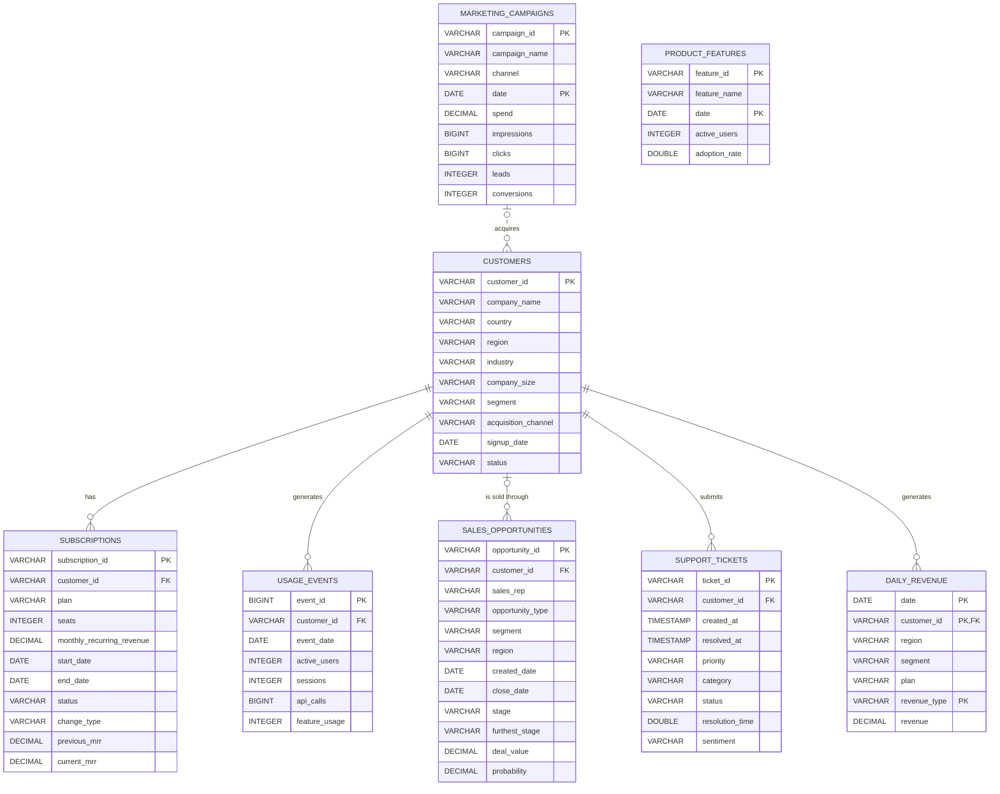

# Data Dictionary — Northwind Cloud

<!-- Generated by `python -m app.database.data_dictionary` from app/database/metadata.py. Do not edit by hand. -->

Schema version **1.0.0**. Database: DuckDB (default `database/northwind_cloud.duckdb`).

Northwind Cloud is a fictional B2B SaaS analytics company headquartered in Singapore. The database holds only business-observable data: what a real company would have in its billing, CRM, product telemetry, support and marketing systems.

## Tables

| Table | Grain | Primary key |
|---|---|---|
| `customers` | One row per customer account. | `customer_id` |
| `subscriptions` | One row per customer subscription period with constant plan, seats and MRR. | `subscription_id` |
| `usage_events` | One row per customer per week (weeks start on Monday). A week is recorded when the customer was subscribed for at least 4 of its 7 days. | `event_id` |
| `sales_opportunities` | One row per opportunity. | `opportunity_id` |
| `support_tickets` | One row per support ticket. | `ticket_id` |
| `marketing_campaigns` | One row per campaign per week (weeks start on Monday). | `campaign_id`, `date` |
| `daily_revenue` | One row per customer per day per revenue type. | `date`, `customer_id`, `revenue_type` |
| `product_features` | One row per feature per day, from the feature's launch date onwards. | `feature_id`, `date` |

## Entity-relationship diagram

Solid lines are declared foreign keys; the dotted line is a logical (non-enforced) relationship.

## Relationships

| Parent | Child | Join | Cardinality | Enforced |
|---|---|---|---|---|
| `customers` | `subscriptions` | customer_id | one customers to many subscriptions | FK |
| `customers` | `usage_events` | customer_id | one customers to many usage_events | FK |
| `customers` | `sales_opportunities` | customer_id | one customers to many sales_opportunities (child may have no parent) | FK |
| `customers` | `support_tickets` | customer_id | one customers to many support_tickets | FK |
| `customers` | `daily_revenue` | customer_id | one customers to many daily_revenue | FK |
| `marketing_campaigns` | `customers` | marketing_campaigns.channel = customers.acquisition_channel (same week as signup_date) | one marketing_campaigns to many customers (child may have no parent) | no (logical) |

## Conventions

| Topic | Convention |
|---|---|
| Currency | All monetary values are in **SGD**. |
| Reporting window | 2024-09-01 to 2026-08-31 (24 full months). "Today" is **2026-08-31**. Customers acquired before the window keep their original `signup_date`. |
| Weeks | `usage_events` and `marketing_campaigns` use weeks starting on **Monday**; only weeks fully inside the window are included (2024-09-02 to 2026-08-30). |
| MRR | Contracted monthly recurring revenue per subscription record. Month-end MRR = records in force on the last day of the month (`v_monthly_mrr`). |
| Subscription history | `subscriptions` is versioned: every expansion or contraction closes the current record (`superseded`) and opens a new one the next day. |
| Churn date | `subscriptions.end_date` of the `churned` record = the last day of service. |
| Revenue recognition | Subscription revenue per day = MRR / days in that calendar month, so a full month recognises exactly the MRR. Usage revenue = API calls above the plan quota x SGD 6 per 1,000, spread evenly over the month's API-enabled days. |
| Revenue vs MRR | Revenue (`daily_revenue`) = recognised subscription + usage revenue for a period. MRR is a point-in-time recurring run-rate and excludes usage revenue. |
| Open items | Open opportunities have `close_date` NULL; open tickets have `resolved_at` and `resolution_time` NULL. |
| PII | Company and sales-rep names are synthetic. `sales_rep` is tagged as PII so later phases can mask it where needed. No contact names or e-mail addresses exist. |

## Table reference

### `customers`

**Business purpose:** Master record for every customer account (company) that has ever held a subscription, including accounts acquired before the reporting window.

**Grain:** One row per customer account.

**Primary key:** `customer_id`

**Foreign keys:** none

| Column | Type | Nullable | Key | Allowed / expected values | Description | Business meaning |
|---|---|---|---|---|---|---|
| `customer_id` | VARCHAR | no | PK | Format CUST-000001; assigned in signup order. | Stable unique customer identifier. | Join key used across all customer-level tables. |
| `company_name` | VARCHAR | no |  | Unique, synthetic company names with a country-specific legal suffix. | Legal name of the customer company (synthetic). | Human-readable account name for reporting. |
| `country` | VARCHAR | no |  | `Singapore`, `Australia`, `Japan`, `India`, `Indonesia`, `United Kingdom`, `Germany`, `France`, `Netherlands`, `United States`, `Canada`, `Brazil`, `Mexico` | Country of the customer's billing entity. | Geographic market; Singapore is the headquarters market. |
| `region` | VARCHAR | no |  | `APAC`, `EMEA`, `North America`, `LATAM` | Sales region derived from country. | Territory used for sales coverage and regional P&L. |
| `industry` | VARCHAR | no |  | `Fintech`, `Retail & E-commerce`, `Healthcare`, `Logistics`, `Manufacturing`, `Media & Entertainment`, `Education`, `Professional Services` | Customer's primary industry. | Vertical used for segmentation and marketing targeting. |
| `company_size` | VARCHAR | no |  | `1-50`, `51-200`, `201-1000`, `1001-5000`, `5000+` | Employee-count band of the customer company. | Determines segment: 1-200 SMB, 201-1000 Mid-Market, 1001+ Enterprise. |
| `segment` | VARCHAR | no |  | `SMB`, `Mid-Market`, `Enterprise` | Commercial segment derived from company size. | Primary segmentation for pricing, sales motion and reporting. |
| `acquisition_channel` | VARCHAR | no |  | `Paid Search`, `Paid Social`, `Email`, `Organic`, `Partner`, `Events`, `Outbound Sales`, `Referral` | Channel that sourced the customer. | Marketing channels match marketing_campaigns.channel; 'Outbound Sales' and 'Referral' have no campaign spend. |
| `signup_date` | DATE | no |  | 2021-01-01 to the dataset end date. | Date the first subscription started. | Start of the customer relationship; basis for cohorts and tenure. |
| `status` | VARCHAR | no |  | `active`, `churned` | Account status as of the dataset end date. | 'churned' means no active subscription at the dataset end date. |

### `subscriptions`

**Business purpose:** Versioned subscription history. A new record starts whenever a customer's contracted MRR changes (expansion or contraction); the prior record is closed as 'superseded'. Churn closes the final record with status 'churned'.

**Grain:** One row per customer subscription period with constant plan, seats and MRR.

**Primary key:** `subscription_id`

**Foreign keys:** `customer_id` -> `customers.customer_id`

| Column | Type | Nullable | Key | Allowed / expected values | Description | Business meaning |
|---|---|---|---|---|---|---|
| `subscription_id` | VARCHAR | no | PK | Format SUB-0000001. | Unique subscription record identifier. |  |
| `customer_id` | VARCHAR | no | FK |  | Customer holding the subscription. |  |
| `plan` | VARCHAR | no |  | `Starter`, `Growth`, `Professional`, `Enterprise` | Subscription plan (price tier). | Starter < Growth < Professional < Enterprise in price and features. |
| `seats` | INTEGER | no |  | Positive integer. | Number of licensed user seats. | Main pricing driver: MRR is approximately seats x plan price per seat. |
| `monthly_recurring_revenue` | DECIMAL(14,2) | no |  | >= 0 | Contracted MRR in SGD for this subscription period. | Recurring revenue while this record is in force. |
| `start_date` | DATE | no |  |  | First day this subscription record is in force. |  |
| `end_date` | DATE | yes |  | >= start_date; NULL only when status = 'active'. | Last day this subscription record is in force; NULL while active. | For churned records this is the last day of service. |
| `status` | VARCHAR | no |  | `active`, `superseded`, `churned` | Record status as of the dataset end date. | 'active' = in force; 'superseded' = replaced by a later record for the same customer (expansion/contraction); 'churned' = customer cancelled. |
| `change_type` | VARCHAR | no |  | `new`, `expansion`, `contraction` | How this record began. | 'new' = first subscription; 'expansion' / 'contraction' = MRR increased / decreased versus previous_mrr. |
| `previous_mrr` | DECIMAL(14,2) | no |  | >= 0 | Customer MRR immediately before this record started (0 for new customers). | MRR movement at start = monthly_recurring_revenue - previous_mrr. |
| `current_mrr` | DECIMAL(14,2) | no |  | = monthly_recurring_revenue when status = 'active', otherwise 0. | MRR contributed by this record as of the dataset end date. | SUM(current_mrr) gives total MRR at the dataset end date. |

### `usage_events`

**Business purpose:** Weekly product-usage telemetry per customer account.

**Grain:** One row per customer per week (weeks start on Monday). A week is recorded when the customer was subscribed for at least 4 of its 7 days.

**Primary key:** `event_id`

**Foreign keys:** `customer_id` -> `customers.customer_id`

| Column | Type | Nullable | Key | Allowed / expected values | Description | Business meaning |
|---|---|---|---|---|---|---|
| `event_id` | BIGINT | no | PK |  | Unique usage record identifier. |  |
| `customer_id` | VARCHAR | no | FK |  | Customer account. |  |
| `event_date` | DATE | no |  |  | Monday that starts the usage week. | Weekly time key for usage trend analysis. |
| `active_users` | INTEGER | no |  | 0 <= active_users <= licensed seats. | Distinct users active during the week (weekly active users). | Core engagement measure; declining values signal disengagement. |
| `sessions` | INTEGER | no |  | >= 0 | Number of user sessions during the week. |  |
| `api_calls` | BIGINT | no |  | >= 0; always 0 on the Starter plan (no API access). | API calls made during the week. | Drives usage (overage) revenue above the plan's included quota. |
| `feature_usage` | INTEGER | no |  | 0 to 12 (bounded by the features available on the plan). | Number of distinct product features used during the week. | Breadth of adoption; broader usage indicates deeper product fit. |

### `sales_opportunities`

**Business purpose:** CRM opportunities for sales-assisted deals: new business (prospects and won customers) and expansion of existing accounts.

**Grain:** One row per opportunity.

**Primary key:** `opportunity_id`

**Foreign keys:** `customer_id` -> `customers.customer_id`

| Column | Type | Nullable | Key | Allowed / expected values | Description | Business meaning |
|---|---|---|---|---|---|---|
| `opportunity_id` | VARCHAR | no | PK | Format OPP-000001. | Unique opportunity identifier. |  |
| `customer_id` | VARCHAR | yes | FK |  | Customer account; NULL for new-business prospects that have not become customers. | Populated for all won and expansion opportunities. |
| `sales_rep` | VARCHAR | no | PII |  | Sales representative who owns the opportunity (synthetic name). | Owner used for rep-level performance analysis. |
| `opportunity_type` | VARCHAR | no |  | `New Business`, `Expansion` | Deal type. |  |
| `segment` | VARCHAR | no |  | `SMB`, `Mid-Market`, `Enterprise` | Segment of the prospect or customer. |  |
| `region` | VARCHAR | no |  | `APAC`, `EMEA`, `North America`, `LATAM` | Sales region (rep territory). |  |
| `created_date` | DATE | no |  |  | Date the opportunity was created. |  |
| `close_date` | DATE | yes |  | >= created_date; within the reporting window. | Date the opportunity was won or lost; NULL while open. |  |
| `stage` | VARCHAR | no |  | `Lead`, `Qualified`, `Proposal`, `Negotiation`, `Won`, `Lost` | Current stage (final stage for closed opportunities). | Lead -> Qualified -> Proposal -> Negotiation -> Won; Lost can occur at any stage. |
| `furthest_stage` | VARCHAR | no |  | `Lead`, `Qualified`, `Proposal`, `Negotiation`, `Won` | Furthest funnel stage reached (for lost deals: the stage at which the deal was lost). | Enables stage-to-stage conversion and drop-off analysis. |
| `deal_value` | DECIMAL(14,2) | no |  | > 0. For won deals = 12 x MRR added. | Annual contract value (SGD) of the opportunity. |  |
| `probability` | DECIMAL(4,2) | no |  | Lead 0.10, Qualified 0.25, Proposal 0.50, Negotiation 0.75, Won 1.00, Lost 0.00. | CRM win probability for the current stage. | Used to weight open pipeline. |

### `support_tickets`

**Business purpose:** Customer support tickets with priority, category, resolution and sentiment.

**Grain:** One row per support ticket.

**Primary key:** `ticket_id`

**Foreign keys:** `customer_id` -> `customers.customer_id`

| Column | Type | Nullable | Key | Allowed / expected values | Description | Business meaning |
|---|---|---|---|---|---|---|
| `ticket_id` | VARCHAR | no | PK | Format TCK-0000001. | Unique ticket identifier. |  |
| `customer_id` | VARCHAR | no | FK |  | Customer that raised the ticket. |  |
| `created_at` | TIMESTAMP | no |  |  | When the ticket was opened. |  |
| `resolved_at` | TIMESTAMP | yes |  | >= created_at | When the ticket was resolved; NULL if still open at the dataset end. |  |
| `priority` | VARCHAR | no |  | `Low`, `Medium`, `High`, `Urgent` | Ticket priority. |  |
| `category` | VARCHAR | no |  | `How-To`, `Bug`, `Integration`, `Performance`, `Billing`, `Account Access`, `Feature Request` | Ticket category. |  |
| `status` | VARCHAR | no |  | `Open`, `Resolved` | Ticket status at the dataset end date. |  |
| `resolution_time` | DOUBLE | yes |  | > 0 hours | Hours from creation to resolution; NULL while open. | Service-level measure; long resolution times hurt customer experience. |
| `sentiment` | VARCHAR | no |  | `Positive`, `Neutral`, `Negative` | Customer sentiment classified from the ticket conversation. |  |

### `marketing_campaigns`

**Business purpose:** Weekly marketing campaign performance: spend and funnel metrics.

**Grain:** One row per campaign per week (weeks start on Monday).

**Primary key:** `campaign_id`, `date`

**Foreign keys:** none

| Column | Type | Nullable | Key | Allowed / expected values | Description | Business meaning |
|---|---|---|---|---|---|---|
| `campaign_id` | VARCHAR | no | PK | Format CMP-001. | Campaign identifier. |  |
| `campaign_name` | VARCHAR | no |  |  | Descriptive campaign name (channel \| theme \| quarter). |  |
| `channel` | VARCHAR | no |  | `Paid Search`, `Paid Social`, `Email`, `Organic`, `Partner`, `Events` | Marketing channel. |  |
| `date` | DATE | no | PK |  | Monday that starts the reporting week. |  |
| `spend` | DECIMAL(14,2) | no |  | >= 0 | Media / programme spend in SGD for the week. |  |
| `impressions` | BIGINT | no |  | >= clicks | Ad impressions, sends or content views. |  |
| `clicks` | BIGINT | no |  | >= leads | Clicks or engaged visits. |  |
| `leads` | INTEGER | no |  | >= conversions | Marketing-qualified leads generated. |  |
| `conversions` | INTEGER | no |  | >= 0 | Leads that became paying customers during the week. | Each conversion corresponds to one customer with acquisition_channel = channel and a signup_date in the same week. |

### `daily_revenue`

**Business purpose:** Daily recognised revenue per customer. Subscription revenue is recognised daily as MRR x 12 / 365; usage revenue is API overage above the plan quota, recognised evenly across the customer's active days in the month.

**Grain:** One row per customer per day per revenue type.

**Primary key:** `date`, `customer_id`, `revenue_type`

**Foreign keys:** `customer_id` -> `customers.customer_id`

| Column | Type | Nullable | Key | Allowed / expected values | Description | Business meaning |
|---|---|---|---|---|---|---|
| `date` | DATE | no | PK |  | Revenue recognition date. |  |
| `customer_id` | VARCHAR | no | PK, FK |  | Customer account. |  |
| `region` | VARCHAR | no |  | `APAC`, `EMEA`, `North America`, `LATAM` | Customer region (denormalised for reporting). |  |
| `segment` | VARCHAR | no |  | `SMB`, `Mid-Market`, `Enterprise` | Customer segment (denormalised). |  |
| `plan` | VARCHAR | no |  | `Starter`, `Growth`, `Professional`, `Enterprise` | Plan in force on this date. |  |
| `revenue_type` | VARCHAR | no | PK | `subscription`, `usage` | Revenue stream. |  |
| `revenue` | DECIMAL(14,2) | no |  | >= 0 | Revenue recognised on this date in SGD. | SUM over a period gives recognised revenue for that period. |

### `product_features`

**Business purpose:** Daily feature-level adoption across the whole customer base.

**Grain:** One row per feature per day, from the feature's launch date onwards.

**Primary key:** `feature_id`, `date`

**Foreign keys:** none

| Column | Type | Nullable | Key | Allowed / expected values | Description | Business meaning |
|---|---|---|---|---|---|---|
| `feature_id` | VARCHAR | no | PK | Format F01-F12. | Feature identifier. |  |
| `feature_name` | VARCHAR | no |  |  | Feature name. |  |
| `date` | DATE | no | PK |  | Calendar date. |  |
| `active_users` | INTEGER | no |  | >= 0 | Users who used the feature on this date. |  |
| `adoption_rate` | DOUBLE | no |  | 0 to 1 | Share of the platform's daily active users who used the feature. | Feature penetration; rising values indicate successful adoption. |

## Analytical views

Views are descriptive building blocks. KPI definitions (churn rate, NRR, CAC, ...) are defined formally in the KPI framework, not in these views.

| View | Description | Source tables |
|---|---|---|
| `v_monthly_revenue` | Recognised revenue by calendar month, region, segment, plan and revenue type. | `daily_revenue` |
| `v_monthly_mrr` | Month-end MRR snapshot per customer: subscriptions in force on the last day of each month in the reporting window. | `subscriptions`, `customers`, `daily_revenue` |
| `v_subscription_events` | Subscription movements derived from the versioned subscriptions table: new, expansion, contraction (at record start) and churn (at the last day of service). | `subscriptions` |
| `v_campaign_summary` | Campaign-level totals of spend and funnel volumes across all active weeks. | `marketing_campaigns` |

## What is deliberately *not* in the database

The synthetic data is produced by a simulation with a hidden customer-health mechanism and
seven injected business events (see `data/README.md`). To keep the database realistic and the
future evaluation honest:

- No hidden generator variable (customer health, engagement, adoption propensity, rep skill,
  API intensity) is stored in any table.
- There is no table describing the injected events. Their ground truth lives in
  `data/seeds/injected_events.json`, outside the database, for evaluation use only.
- The generator's validation checks for those events live in `data/generator/` and are not
  exposed to the agent.

A validation check (`exposure:*`) fails the build if the database contains any table, view or
column that is not documented here.
