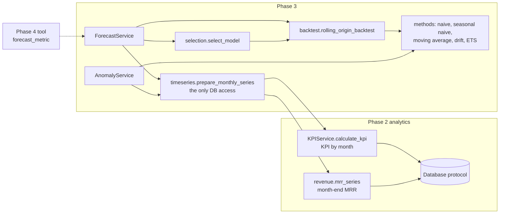

# Forecasting (Phase 3)

> **Forecasts use only information available at the cutoff.** Every forecast is produced by a
> deterministic, auditable procedure: prepare a monthly series, backtest candidate models,
> compare them with a naive baseline, select one using historical backtests only, refit it and
> forecast with prediction intervals. Each step is recorded in a typed result. The future
> agent (Phase 4) can explain these results. It never computes a forecast itself.

- Anomaly detection: [anomaly-detection.md](anomaly-detection.md)
- KPI definitions (the numbers that are forecast): [kpi-catalog.md](kpi-catalog.md) and [analytics.md](analytics.md)

## 1. Architecture



| Module | Responsibility |
|---|---|
| `app/timeseries/metrics.py` | Allow-list of forecastable metrics (each an existing KPI), their filters and missing-data policy |
| `app/timeseries/preparation.py` | Builds a continuous monthly `TimeSeries` via Phase 2; the only Phase 3 database access |
| `app/timeseries/models.py` | `TimeSeriesPoint`, `TimeSeries` (typed, with provenance) |
| `app/forecasting/config.py` | `ForecastConfig`: every tunable number |
| `app/forecasting/baselines.py` | Naive, seasonal naive, moving average, drift |
| `app/forecasting/statistical.py` | ETS(A,Ad,N) damped-trend exponential smoothing (statsmodels) |
| `app/forecasting/methods.py` | The model allow-list (`build_method`) |
| `app/forecasting/backtest.py` | Rolling-origin (expanding-window) backtest engine |
| `app/forecasting/evaluation.py` | MAE, RMSE, MAPE, WAPE, bias, interval coverage |
| `app/forecasting/selection.py` | Backtest-based model selection and its nested out-of-sample evaluation |
| `app/forecasting/models.py` | `ForecastRequest`, `ForecastResult` and related contracts |
| `app/forecasting/service.py` | `ForecastService`, `forecast_metric`, and the pure core `forecast_series` |

The Phase 3 packages import no database driver and no agent, LLM, MCP, API or UI framework. They
never read the generator or the injected-event ground truth. They make no network calls and do
not use the system clock or random numbers (`tests/unit/test_phase3_isolation.py`).

## 2. Supported metrics

Every metric is a registered Phase 2 KPI, so a forecast is always about the same number that
`calculate_kpi` reports.

| Metric key | Series | Built from | Filters (explicit, one group per request) |
|---|---|---|---|
| `revenue` | Recognised revenue per calendar month (SGD) | `revenue` KPI by `month` | region, country, segment, industry, acquisition_channel, plan, revenue_type |
| `mrr` | MRR at each month end (SGD per month) | Phase 2 `mrr_series` | region, country, segment, industry, acquisition_channel, plan |
| `customer_count` | Active customers at each month end | Phase 2 `mrr_series` | as `mrr` |
| `support_ticket_volume` | Tickets created per calendar month | `support_ticket_volume` KPI by `month` | region, country, segment, industry, acquisition_channel, ticket_category, ticket_priority |
| `product_adoption` | Average daily adoption rate of one feature per month | `product_adoption` KPI by `month` | product_feature (**required**) |

`customer_id` and other single-entity filters are not accepted: single-account monthly series are
too small to forecast. Dimension combinations are never forecast automatically. A caller asks for
one explicit group, for example `filters={"region": "APAC"}`.

Other series the schema could support (logo churn rate, CAC, win rate per month) are not in the
Phase 3 scope. They are ratios with small monthly denominators, which would need count-aware
models.

## 3. Time-series preparation and missing data

`prepare_monthly_series(db, metric, filters=..., end_date=cutoff)` returns a `TimeSeries`:
`metric, grain="month", start, end, points[period, start, end, value, observation], filters,
source_tables, calculation, query_id, provenance`. Aggregation runs in DuckDB. Python receives
at most one row per month (24 for the full window).

| Situation | Treatment | `observation` |
|---|---|---|
| Month has rows | The aggregated value | `observed` |
| Revenue / MRR / customers / tickets month without rows, inside the data coverage | **Zero**: these tables record every event, so no rows means nothing happened | `true_zero` |
| Adoption month without rows after the feature appeared | **Missing** (`value=None`): an average of nothing is undefined | `missing` |
| Months before a feature is first observed | Not part of the series (the series starts at the first observation) | none |
| Incomplete months, months outside the data coverage | Never part of a series | none |

Models need a gap-free history. When a series contains a missing month, only the months after the
last missing month are used, and the result says so. No imputation is performed.

## 4. Cutoff and the business as-of date

- The business "today" is `Settings.as_of_date` (**2026-08-31**), never the machine clock.
- `cutoff_date` defaults to it. A later cutoff is rejected (`InvalidPeriodError`) because those
  observations do not exist.
- The series ends at the **last complete month on or before the cutoff**. With cutoff 2026-08-31
  the history ends in August 2026 and the forecast covers September, October, and so on. A
  mid-month cutoff (2026-08-20) ends the history in July 2026.
- Every query is bounded by the cutoff (`$end_date`). No row after the cutoff is read (tested on
  the real database, see §12).

## 5. Horizons

`horizon` is 1 to 6 months (1, 3 and 6 are the standard horizons). Anything else raises
`InvalidHorizonError`. Longer horizons are not supported: with 24 monthly observations, a
6-month horizon already leaves only 7 backtest folds.

## 6. Models

| Model | Point forecast for step h | Min. history | Prediction interval |
|---|---|---|---|
| `naive` (baseline, mandatory) | last value | 1 | analytic: σ·√h |
| `seasonal_naive` | value one season (12 months) earlier | 12 | analytic: σ·√(k+1), k = ⌊(h−1)/12⌋ |
| `moving_average` | mean of the last 3 months | 3 | residual-based: RMS of the method's own h-step errors |
| `drift` | y_T + h·(y_T − y_1)/(T − 1) | 2 | analytic: σ·√(h(1 + h/(T−1))) |
| `ets_damped_trend` | ETS(A,Ad,N) damped additive trend, maximum likelihood (statsmodels `ETSModel`) | 10 | model-derived: analytic ETS variance (`method="exact"`) |

For the baselines, σ is the residual standard deviation of the method's one-step residuals,
`sqrt(Σe² / (N − K))`, with K estimated parameters (1 for drift). This follows Hyndman &
Athanasopoulos, *Forecasting: Principles and Practice* (3rd ed.), §5.5. The drift variance follows
from the forecast error, which is the sum of h future shocks minus h·(b̂ − b), with
Var(b̂) = σ²/(T − 1).

**Why damped-trend ETS.** It tracks a local level and trend but flattens the trend over the
horizon. Damped-trend smoothing is a well-studied, robust default for short business series. It has five
interpretable parameters (α, β, φ, initial level, initial trend), and as a linear state-space
model it has analytic prediction intervals. Its fitted parameters and optimiser warnings are
recorded in the result.

**Why no Holt-Winters / seasonal ETS / ARIMA.** The data window has 24 monthly points. Backtest
folds train on 12–23 months, i.e. fewer than two full seasonal cycles, so a seasonal statistical
model could never be validated before being used. Seasonality is represented by the
seasonal-naive baseline, and `seasonality.estimable` in the result states whether at least two cycles
exist. One well-understood statistical model was preferred over a grid of models that the
short history cannot discriminate.

## 7. Backtesting methodology

Rolling-origin evaluation with an **expanding window**, never a random split:

```
fold 1: train 2024-09 .. 2025-08 (12 months)   validate the next h months
fold 2: train 2024-09 .. 2025-09 (13 months)   validate the next h months
...
last:   train 2024-09 .. (2026-08 minus h)      validate up to 2026-08
```

- Initial window `minimum_history = 12` months, step 1 month, every origin whose validation
  window ends on or before the cutoff.
- Every fold records `training_start, training_end, validation_start, validation_end,
  predictions, actuals, lower, upper`, so the whole backtest can be audited.
- A forecast needs at least `min_backtest_folds = 3` folds:
  `required history = 12 + (3 − 1) + h` = 15 months (h=1), 17 (h=3) and 20 (h=6).
  Shorter series return `status="insufficient_history"` with the counts.
- With the full 24 months, a forecast at the as-of date has 12 folds (h=1), 10 (h=3) or 7 (h=6).

## 8. Error metrics

Computed over all fold predictions (e = forecast − actual):

| Metric | Definition | Notes |
|---|---|---|
| MAE | mean(\|e\|) | metric units; the default selection metric |
| RMSE | √mean(e²) | tie-breaker; penalises large errors |
| Bias | mean(e) | positive = over-forecast on average |
| WAPE | Σ\|e\| / Σ\|actual\| | fraction; defined with individual zero actuals; preferred scale-free measure |
| MAPE | mean(\|e\| / \|actual\|) | fraction; **zero-denominator policy** below |
| Interval coverage | share of actuals inside the reported interval | over points where an interval exists |

**Zero-denominator policy (MAPE).** MAPE is reported only when every actual is non-zero and at
least 1% (`mape_near_zero_fraction`) of the mean absolute actual. Otherwise MAPE is `None` with a
note pointing to WAPE. It is never infinite, and points are never silently dropped. MAPE is always
computed over the same months as MAE and RMSE. WAPE is `None` only if every actual is zero.

## 9. Model selection

1. Candidates that could not forecast on **every** fold are ineligible. All eligible candidates
   are scored on the same months.
2. Rank by backtest MAE, then RMSE, then candidate order (simpler baselines first).
3. The winner must be **strictly better than the naive baseline**; otherwise `naive` is selected.
4. The selected model is refitted on the whole history up to the cutoff and forecasts h months.

Selection uses historical backtests only. The months being forecast are never observed, and
backtest validation windows never extend past the cutoff. `selected_model_reason` states the
comparison neutrally, for example: *"Selected drift: lowest historical backtest MAE (54,537)
across 10 rolling-origin folds, lower than the naive baseline's MAE (225,437) (75.8% lower)."*
A model is never called "accurate" because it ran.

**Selection bias and its honest evaluation.** The selected model's backtest metrics were also
used to pick it, so they are optimistic, and the result says so. `ForecastService.evaluate_selection`
measures the whole procedure without that bias. At each later origin it re-runs selection using only
earlier data, forecasts, and scores against the months that follow. It compares this with always
using the naive baseline. A caller can also request a specific model (`model="ets_damped_trend"`).
It is then still backtested and compared with the naive baseline.

## 10. Prediction intervals

The bounds are **prediction intervals**: ranges for the individual future monthly values at
`confidence_level` (default 95%). They are not confidence intervals for a mean, and the result
labels them `kind="prediction_interval"` with the method used:

| Method | Type |
|---|---|
| naive, seasonal naive, drift | analytic, from the method's residual standard deviation (normal, uncorrelated errors) |
| moving average | residual-based (empirical h-step errors of the method on the training data) |
| ets_damped_trend | model-derived analytic state-space variance |

All of them ignore parameter-estimation uncertainty, so they can be too narrow. The backtest
therefore reports **empirical coverage** for each model, and the forecast result repeats the
selected model's coverage as a limitation. When too few residuals exist (fewer than 3),
no interval is fabricated. The forecast is returned with `interval.available=false` and a
reason. Bounds outside a metric's possible range (below 0; above 1 for adoption) are limited to
it, and the result says so.

## 11. Result contract

`ForecastResult` (all fields typed, JSON-serialisable):

| Group | Fields |
|---|---|
| Identity | `operation="forecast"`, `metric`, `metric_name`, `unit`, `status` (`ok`, `no_data`, `insufficient_history`, `insufficient_data`), `message` |
| Forecast | `model`, `cutoff_date`, `horizon`, `forecast_points[period, start, end, predicted_value, lower_bound, upper_bound]`, `lower_bound`, `upper_bound`, `confidence_level`, `interval` |
| History | `historical_start`, `historical_end`, `history_observations`, `sufficient_history`, `seasonality`, `history` (the full `TimeSeries`) |
| Evidence | `backtests` (every candidate, every fold), `candidates` (summary), `backtest_metrics` (selected), `baseline_metrics` (naive), `selected_model_reason`, `improvement_over_baseline` |
| Method | `method`: model, description, fitted parameters, full `ForecastConfig`, training window, cutoff, random seed, fit notes |
| Provenance | `filters`, `source_tables`, `calculation`, `query_id`, `query_ids`, `operation_id`, `execution_timestamp`, `provenance` (every SQL statement with its bound parameters and lineage record) |
| Caveats | `limitations` |

A result can answer "how was this forecast calculated?" on its own. It carries the SQL that built
the history, every backtest fold, the selection rule's comparison, the fitted parameters, and the
interval method with its historical coverage.

## 12. Leakage prevention

| Rule | Mechanism | Test |
|---|---|---|
| No future rows are read | Series queries are bounded by the cutoff; later cutoffs rejected | `test_timeseries_integration.py::test_cutoff_bounds_the_series_and_every_query` |
| The series cannot extend past the cutoff | `forecast_series` refuses such a series | `test_forecasting_leakage.py` |
| Folds see only their training slice | Each fold forecasts from `y[:origin]` | `test_forecasting_backtest.py`, `test_forecasting_leakage.py` |
| Validation is after training | Origins are chronological; asserted per fold | `test_forecasting_backtest.py`, reference split test |
| Selection uses history only | Folds end at or before the cutoff; nested evaluation re-selects at each origin | `test_forecasting_leakage.py` |
| Changing the future changes nothing at the cutoff | A copy of the real database is altered after 2026-05-31 (revenue ×5, new subscriptions ×5 MRR, tickets deleted, adoption set to 0.99); forecasts at 2026-05-31 are identical on both | `test_phase3_leakage_database.py` |

There is no random splitting, no shuffling and no random-number generation anywhere in Phase 3.
Every method is closed-form or a deterministic optimiser with analytic intervals. The configured
`random_seed` is recorded in provenance for completeness.

## 13. Measured results (seed-42 dataset, cutoff 2026-08-31)

These numbers are measured, not targets. They come from running `ForecastService` on the
generated dataset during Phase 3 development. They are backtest errors over rolling-origin folds;
lower is better.

| Metric | h | Selected | Folds | Backtest MAE (selected) | Backtest MAE (naive) | WAPE selected / naive | 95% interval coverage (selected) |
|---|---|---|---|---|---|---|---|
| revenue | 3 | drift | 10 | 54,540 SGD | 225,400 SGD | 1.03% / 4.24% | 87% |
| mrr | 3 | drift | 10 | 52,000 SGD | 220,300 SGD | 0.99% / 4.21% | 87% |
| customer_count | 3 | drift | 10 | 29.5 | 115.9 | 0.89% / 3.50% | 87% |
| support_ticket_volume | 3 | drift | 10 | 203.6 | 266.6 | 7.72% / 10.11% | 73% |
| product_adoption (Dashboards) | 3 | ets_damped_trend | 10 | 0.0010 | 0.0020 | 0.12% / 0.25% | 100% |

Observations, stated as measured:

- The series grow steadily, so the naive baseline lags. Drift was selected for four of the five
  metrics at every horizon (1, 3, 6).
- **ETS intervals were too narrow in the backtests.** At h=3 the 95% ETS intervals contained 57%
  (revenue), 60% (MRR), 63% (customers) and 37% (tickets) of actual values. In the fits inspected
  during development, the maximum-likelihood smoothing parameters were often at their bounds (for
  example α = 0), and the intervals ignore parameter uncertainty. Drift intervals held better
  (73–87%). This is why coverage is reported next to every forecast.
- Ticket forecasts carry the most uncertainty (drift WAPE 6.0–7.7% across horizons 1–6),
  because the June–July 2026 ticket spike is part of the history.
- **Nested evaluation of the selection rule** (out of sample, h=1, 9 origins): the selected
  model's MAE compared with always using the naive baseline was 54,340 vs 109,200 (revenue),
  43,370 vs 99,220 (MRR), 26.9 vs 50.3 (customers) and 199.7 vs 211.1 (tickets). At h=6 the
  24-month history is too short for a nested evaluation, and the service says so.

## 14. Performance

Median warm latencies on the full dataset (about 2.8M rows), measured on the development container:
one forecast 160–390 ms (series query plus all backtests); one nested selection evaluation
0.4–1.6 s. The first ETS fit in a process also pays a one-off statsmodels import (about 1.5 s).
Budgets are enforced by `tests/integration/test_phase3_performance.py`.

## 15. Limitations

- At most 24 monthly observations: seasonality has been seen at most twice, and backtests have
  7–12 folds. The metrics are informative but noisy.
- Intervals assume normal, uncorrelated errors and ignore parameter uncertainty (see §10 and the
  measured coverage in §13).
- Forecasts extrapolate history. They cannot anticipate events that have not yet affected the
  data, and they do not explain why a metric moves.
- The selected model's backtest metrics are optimistic (selection bias); use `evaluate_selection`
  for an unbiased view.
- Intermittent series (more than 20% zero months, `max_zero_share`) return `insufficient_data`:
  the additive models assume a continuous level.
- Monthly revenue includes a small calendar effect (usage revenue scales with days in the month).
  It is not modelled explicitly.

## 16. How Phase 4 will consume this

The planned `forecast_metric` tool maps directly onto the service:

```python
from app.database import get_database
from app.forecasting import forecast_metric

result = forecast_metric(get_database(), "mrr", horizon=3, filters={"segment": "Enterprise"})
result.status                     # "ok" | "no_data" | "insufficient_history" | "insufficient_data"
result.forecast_points            # period, predicted_value, lower_bound, upper_bound
result.selected_model_reason      # neutral comparison with the naive baseline
result.backtest_metrics, result.baseline_metrics
result.limitations                # caveats to surface with the numbers
result.query_ids, result.operation_id  # evidence references
```

The evidence layer registers `operation_id` / `query_ids` as the source of any forecast claim and
must surface `limitations` (interval coverage, selection bias) with the numbers. A non-`ok` status
is an explicit "insufficient evidence" answer, never an invitation to estimate.

## 17. Configuration reference (`ForecastConfig`)

| Field | Default | Meaning |
|---|---|---|
| `confidence_level` | 0.95 | Prediction-interval level (0.5 < level < 1) |
| `minimum_history` | 12 | Months in the first backtest training window |
| `min_backtest_folds` | 3 | Minimum rolling-origin folds for a forecast |
| `backtest_step` | 1 | Months between fold origins |
| `candidates` | all five models | Must include `naive` |
| `selection_metric` | `mae` | `mae` or `rmse` (the other is the tie-breaker) |
| `season_length` | 12 | Seasonal-naive period |
| `moving_average_window` | 3 | Moving-average window |
| `max_zero_share` | 0.2 | Above this share of zero months, `insufficient_data` |
| `mape_near_zero_fraction` | 0.01 | MAPE withheld below this share of the mean absolute actual |
| `random_seed` | 42 | Recorded in provenance; no current step is stochastic |
